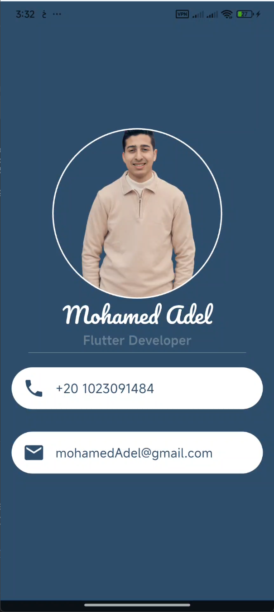

# 📇 Business Card App

A premium, sleek, and modern **Business Card Application** built with **Flutter**. This project demonstrates a clean UI/UX implementation focusing on minimalist design and professional aesthetics.

---

## 🎨 Design Showcase

|  |
---

## 🚀 Features

- **Premium UI:** Uses a professional deep navy palette (#304E69) with a clean white contrast.
- **Custom Typography:** Integrated **Pacifico** font for a personalized, handwritten feel.
- **Responsive Layout:** Perfectly centered elements using Flutter's layout engine.
- **Interactive Information:** Clear display of contact details (Phone & Email) using standard material icons.
- **Circular Aesthetics:** Double-layered `CircleAvatar` for a professional profile picture frame.

---

## 🛠️ Built With

- **[Flutter](https://flutter.dev/):** The UI framework for building beautiful natively compiled applications.
- **[Dart](https://dart.dev/):** The client-optimized language for fast apps on any platform.
- **Custom Fonts:** Pacifico (via Google Fonts/Assets).

---

## 📥 Getting Started

Follow these steps to run the project locally:

1.  **Clone the repository:**
    ```bash
    git clone https://github.com/YOUR_USERNAME/flutter-business-card.git
    ```
2.  **Navigate to the project directory:**
    ```bash
    cd business_card_app
    ```
3.  **Get dependencies:**
    ```bash
    flutter pub get
    ```
4.  **Run the app:**
    ```bash
    flutter run
    ```

---

## 📁 Project Structure

```text
lib/
└── main.dart          # Core application logic and UI
assets/
└── images/            # Profile images
fonts/
└── Pacifico/          # Custom typography files
```

---

## 👤 Author

**Mohamed Adel**
- 💼 Flutter Developer
- 📧 mohamedAdel@gmail.com
- 📱 +20 1023091484

---

## 📄 License

This project is open-source and available under the [MIT License](LICENSE).
